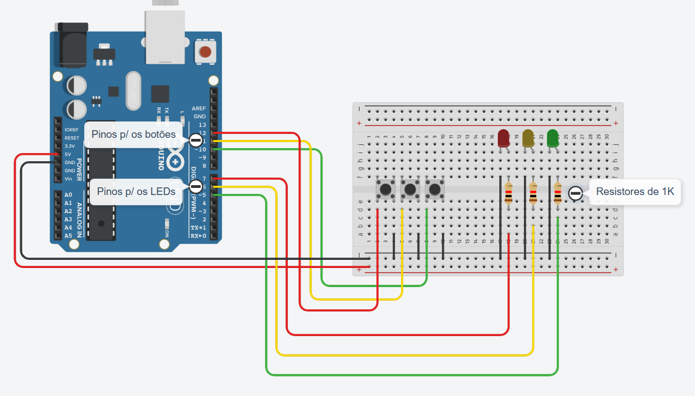

## Projeto: Genius

O projeto é uma implementação no jogo Genius no Arduino, usando apenas três LEDs, três botões, jumpers, o Arduino e uma protoboard.
Abaixo, está o circuito simulado no Tinkercad:

E aqui, o circuito montado no Arduino:

Proposto por @Er1c-CH
